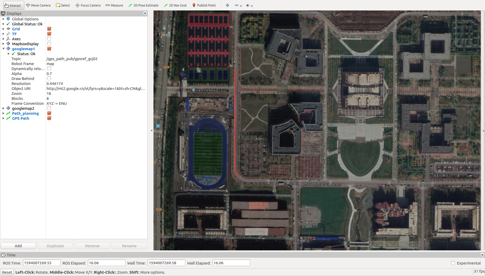
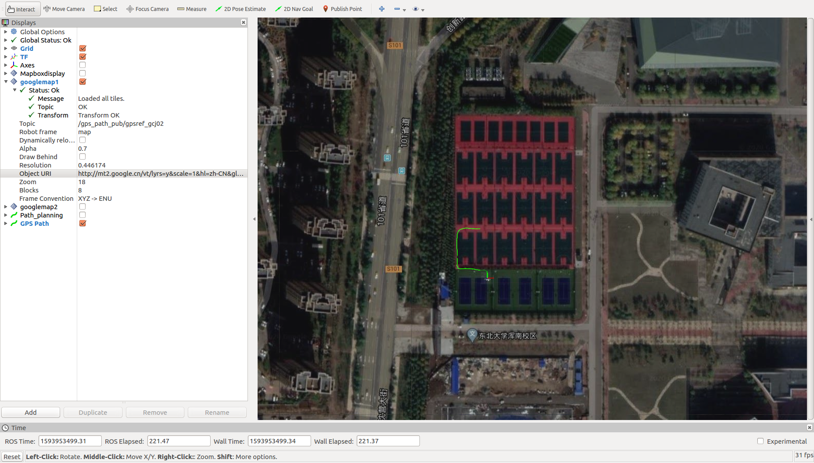
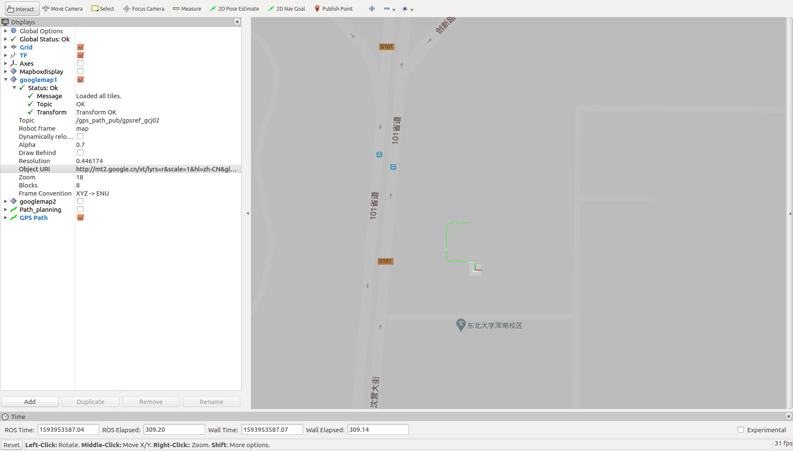

# path_api_display
Provide route planning from Gaode or Baidu Map API and display route 


## 1. 准备

```
$ cd path_api_display
$ catkin_make
$ source devel/setup.bash
```

## 2. Demo

```
$ roslaunch get_path demo.launch
```

本程序中起点是gps当前的位置，然后使用rviz的2D Nav Goal来确定终点位置，即可显示，如下图的规划轨迹



video：https://youtu.be/e1X4xJVJvRE

## 3. 地图显示格式

该插件设置的参数不同，显示不同，详见gps_path_pub/README.md

lyrs=y



lyrs=r



## 4. 引用

1. [rviz_satellite](https://github.com/gareth-cross/rviz_satellite)，rviz插件，根据瓦片地图URL在rviz里面显示地图，该工作空间使用其`1e7b2a7d0becae132b24c15c9fc3eebf119f49c2` commit
2. [gps_path_pub](https://github.com/rpng/gps_path_pub)，根据不同时刻的gps位置来发布路径
3. [coordTransform_py](https://github.com/wandergis/coordTransform_py)，提供gcj02,bd09,wgs84坐标系之间的转换